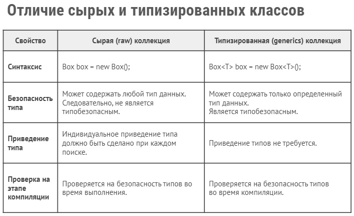

17.02.2023
---
## lesson16

### Generics в коллекциях и методах

	16.1		Generic классы и методы

#### Шаблонизировать java классы
+ плохо
+ + класс Memory
```java
public class Memory {
    protected String value;

    public void save(String value) {
        this.value = value;
    }

    public String getlast() {
        return value;
    }
}
```
+ + класс Main
```java
public class Main {
    public static void main(String[] args) {
        Memory memory = new Memory();
        memory.save("Petya");
        memory.save("Olya");
        memory.save("Tanya");
        System.out.println(memory.getlast());
    }
}
```
+ ещё хуже
+ + класс Memory
```java
public class Memory {
    protected Object value;

    public void save(Object value) {
        this.value = value;
    }

    public Object getlast() {
        return value;
//        return new Integer(100);
    }
}
```
+ + класс Main
```java
public class Main {
    public static void main(String[] args) {
        Memory memory = new Memory();
        memory.save("Petya");
        memory.save("Olya");
        memory.save("Tanya");
        String value = (String) memory.getlast(); // Заставляем java считать типом данных (String)
    }
}
```
+ Generic
+ + класс Memory
```java
public class Memory<T> { // тип T - параметр самого класса; можно использовать несколько <T, U>
    protected T value;

    public void save(T value) {
        this.value = value;
    }

    public T getlast() {
        return value;
    }
}
```
+ + класс Main
```java
public class Main {
    public static void main(String[] args) {
        Memory<String> memory = new Memory(); // необязательно указывать здесь `new Memory<String>`
        memory.save("Petya");
        memory.save("Olya");
        memory.save("Tanya");
        String value = memory.getlast();
        System.out.println(value);
    }
}
```
#
>Для указания типа дженериков используются только ***классы***. Примитивные типы использовать нельзя. Таким образом, нельзя использовать типы `int`, `double` и и.п. Вместо примитивных типов надо использовать *классы-обертки*: **`Integer`** вместо `int`, **`Double`** вместо `double` и т.д. Например, **`Box<Integer>`** или **`Box<Double>`**
#
#### Шаблонизировать java методы
+ плохо
+ + класс Main
```java
public class Main {
    public static void main(String[] args) {
        Memory<String> memory = new Memory(); // необязательно указывать здесь `new Memory<String>`
        memory.save("Petya");
        memory.save("Olya");
        memory.save("Tanya");
        String value = memory.getlast();
        System.out.println(value);

        String v1 = "Petya";
        String v2 = "Olya";
        String result = choose(true, v1, v2);
        System.out.println(result);
    }

    public static String choose(boolean flag, String first, String second) {
        if (flag) {
            return first;
        } else {
            return second;
        }
    }
}
```
+ ещё хуже, если заменить String на Object
```java
public static Object choose(boolean flag, Object first, Object second)
```
+ и снять ответственность с java
```java
String result = (String) choose(true, v1, v2);
```
+ Generic
+ + класс Main
```java
public class Main {
    public static void main(String[] args) {
        Memory<String> memory = new Memory(); // необязательно указывать здесь `new Memory<String>`
        memory.save("Petya");
        memory.save("Olya");
        memory.save("Tanya");
        String value = memory.getlast();
        System.out.println(value);

        String v1 = "Petya";
        String v2 = "Olya";
        String result = choose(true, v1, v2);// даже не указываем явным образом (String)
		String result1 = Main.<String>choose(true, v1, v2);// можно так через Класс.<>, но зачем?
        System.out.println(result);
    }

    public static <T> T choose(boolean flag, T first, T second) {
        if (flag) {
            return first;
        } else {
            return second;
        }
    }
}
```
+ Итог:
+ + используя generic метод, даже не указываем явным образом (String), так как это в одном месте программы в отличие от классов
+ + проверка в момент компиляции! нельзя внутри создать новое значение типа через `T t = new`

+ + в случае с generic классами всегда ставьте угловые скобки, иначе это сырой тип (?)
#
	16.2		Generic и наследования

+ Во-первых:
+ + нельзя использовать полиморфизм вот так `Memory<Number> memory = new Memory<Integer>();`
+ + только так надо `Memory<String> memory = new Memory<>(); // правильно делать так <>`
+ Во-вторых:
+ + только имена параметров <T, U, R> без указания их типов `public static <T> T choose(boolean flag, T first, T second) `
+ + можем конкретизировать и ограничить типы `public static <T extends Number> T choose(boolean flag, T first, T second)`
+ + в другую сторону тоже `public static <T super Number> T choose(boolean flag, T first, T second)` (?)
+ + и сразу появляются все методы предка: `choose().`, `first.`
+ наследования:
+ + создаем generic интерфейс, например `Savable` 
```java
public interface Savable<T> {
    void save(T obj);
}
```
+ + класс Memory
```java
public class Memory<T> implements Savable<T> {// передаём интерфейсу полученный классом параметр <T>
    protected T value;

    public void save(T value) {
        this.value = value;
    }

    public T getlast() {
        return value;
    }
}
```
> Важно! Интерфейсу передаём значение параметра, а не конкретный параметр: именно `T`, а не `String`, к примеру
+ + класс Main
```java
public class Main {
    public static void main(String[] args) {
        Integer i = 100;
        Number n = i;

        Memory<Number> memory = new Memory<>(); // правильно делать так <>
        memory.save(100);
        memory.save(300);
        memory.save(500);
        Number value = memory.getlast();
        System.out.println(value);

        int v1 = 100;
        int v2 = 500;
        int result = choose(true, v1, v2);
        System.out.println(result);
    }

    public static <T extends Number> T choose(boolean flag, T first, T second) {
        if (flag) {
            return first;
        } else {
            return second;
        }
    }
}
```

#
> можно в IDEA поставить курсор на `save` и нажать `ctrl alt b` для перехода к его реализации

---
[*мои конспекты*](./README.md)
