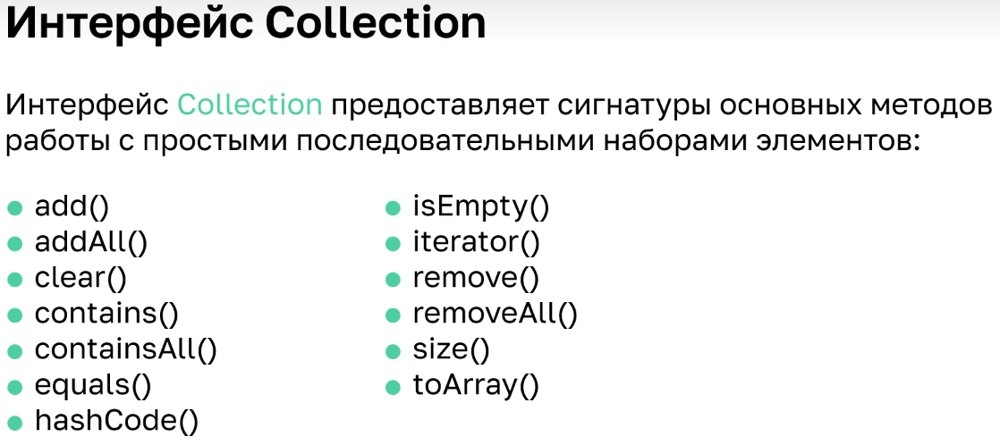

23.02.2023
---
## lesson17

### Коллекции List

	17.1		Класс ArrayList

```java
ArrayList<String> list = new ArrayList<>();
list.add("Petya");
list.add("Olya");
list.add("Tanya");
System.out.println(list);
System.out.println(list.size());
list.set(0,"Kolya");
System.out.println(list);
System.out.println(list.get(1));
list.add(1,"Pasha");
System.out.println(list);
System.out.println("проверяем наличие Olya: "+list.contains("Olya"));
```
+ ArrayList - это дженерик и использует только ссылочный тип данных! 
+ В отличие от простых массивов работает немного медленнее и занимает больше памяти. 
+ Достойная альтернатива массивам - имеет новые более удобные методы.
+ ArrayList не может содержать в себе данные с примитивным типом. Он может содержать только объекты.

+ + класс Main
```java
import java.util.ArrayList;
import java.util.Arrays;

public class Main {
public static void main(String[] args) {
//      [0, 1, 2, _, _, _, ...]
ArrayList<String> list = new ArrayList<>();
list.add("Petya");
list.add("Olya");
list.add("Tanya");
System.out.println(list);
System.out.println(list.size());
list.set(0, "Kolya");
System.out.println(list);
System.out.println(list.get(1));
list.add(1, "Pasha");
System.out.println(list);
System.out.println("проверяем наличие Olya: " + list.contains("Olya"));
// получить индекс первого элемента с указанным значением, если не найдено, то -1
int pos = list.indexOf("Mark");
System.out.println(pos);
// получить индекс последнего элемента с указанным значением, если не найдено то -1
pos = list.lastIndexOf("Tanya");
System.out.println(pos);
// получить все элементы списка в виде массива
String[] peopleArray = list.toArray(new String[0]);
System.out.println(Arrays.toString(peopleArray));
System.out.println(peopleArray[1]);
// получить часть массива
ArrayList<String> people =new ArrayList<>(list.subList(1, 3));
System.out.println(people);
}
}
```
#
	17.2		Иерархия коллекций и итераторы


#### Interface List
+ `ArrayList` - это пронумерованный список
+ `Vector` - устаревший и не используется, потому что медленный
+ `LinkedList` - на других принципах и отличается от ArrayList по скорости работы на некоторых операциях
#### Interface Set 
+ - просто набор элементов и не неважно в каком порядке

+ метод `toArray` позволяет сконвертировать коллекцию в массив
+ получить все элементы списка в виде массива `String[] peopleArray = people.toArray()` - фиг! См. 17.1

+ по правилам полиморфизма
```java
List<String> list = new ArrayList<>();// по правилам полиморфизма
list.add("Petya");
list.add("Olya");
list.add("Tanya");

//      обычный способ из массивов
for (int i = 0; i < list.size(); i++) {
	System.out.println(list.get(i));
}
System.out.println("или так");
for (String s:list) {
	System.out.println(s);
}
```

```java
//      Итерирование по List
Iterator<String> iterator = list.iterator();
while (iterator.hasNext()) {
String s = iterator.next();
System.out.println(s);
}
```
+ `foreach` - как раз и использует итератор
+  Изначальное задание емкости `ArrayList` позволяет снизить перераспределения памяти в процессе расширения, тем самым повышая производительность.
+ + класс Main
```java
import java.util.ArrayList;
import java.util.Iterator;
import java.util.List;

public class Main {
public static void main(String[] args) {
//      [0, 1, 2, _, _, _, ...]
List<String> list = new ArrayList<>();// по правилам полиморфизма
list.add("Petya");
list.add("Olya");
list.add("Tanya");

//      обычный способ из массивов
for (int i = 0; i < list.size(); i++) {
System.out.println(list.get(i));
}
System.out.println("или так");
for (String s : list) {
System.out.println(s);
}
System.out.println("Итерирование по List");
Iterator<String> iterator = list.iterator();
while (iterator.hasNext()) {
String s = iterator.next();
System.out.println(s);

List<String> fruits = Arrays.asList("Apple", "Orange", "Banana", "Grapefruit", "Grapes", "Lemon");
System.out.println("Обычный цикл");
for (int i =0; i < fruits.size(); i++) {
String fruit = fruits.get(i);
System.out.println("fruit: "+ fruit);
}
System.out.println("foreach цикл");
for (String fruit : fruits) {
System.out.println("fruit: "+ fruit);
}
System.out.println("Обычный цикл с итератором");
for (Iterator<String> it = fruits.iterator(); it.hasNext(); ) {
String fruit = it.next();
System.out.println("fruit: "+ fruit);
}
System.out.println("Итератор с циклом while");
Iterator<String> it = fruits.iterator();
while (it.hasNext()) {
String fruit = it.next();
System.out.println("fruit: "+ fruit);
}

//      А вот это прям совсем интересно - что это?
System.out.println("Stream forEach из Java 8");
fruits.stream()
.filter(fruit -> !fruit.equals("Potato"))
.forEach(fruit -> System.out.println("fruit: " + fruit));

System.out.println("for each из Java 8");
fruits.forEach(fruit -> System.out.println("fruit: " + fruit));
}
}
```
+ что-то мутное про удаление
```java
import java.util.ArrayList;
import java.util.Iterator;

public class Main {
public static void main(String[] args) {
ArrayList<String> countries = new ArrayList<String>();
countries.add("Russia");
countries.add("France");
countries.add("Italy");
countries.add("Spain");
Iterator<String> iter = countries.iterator();
while (iter.hasNext()) {
String currentCountry = iter.next();
System.out.println(currentCountry);
if (currentCountry.equals("Italy")) {
iter.remove();
}
}
System.out.println(countries);
}
}
```

#
	17.3		LinkedList
+ метод `add` (и `remove` тоже) в `ArrayList` для конца работает быстро, а для особенно начала - долго, так как пересоздает новый массив со сдвигом
+ `LinkedList` не использует внутри себя массивы - он использует ячейки для каждого элемента
+ объект `LinkedList` помнит первую и последнюю ячейку, а каждая ячейка в специальном поле помнит соседей

+ `LinkedList` - это связанный список
+ операции `get` и `set` будут зависеть от размера списка и номера нужного элемента, так как идёт последовательный перебор в поиске указанного номера

#### Итого
+ в основном используют ArrayList, а для специфических случаев (когда например нужна скорость добавлени/удаления начального элемента) можно применить LinkedList
+ Интерфейсы Collection и Map из пакета java.util делят все коллекции по типу хранения данных на два вида: простые последовательные наборы элементов и наборы пар «ключ — значение» (словарь или ассоциативный массив).

+ Интерфейс `Set` - коллекция будет полезна, если необходимо не допускать дубликатов объектов в коллекции и не нужен порядок хранения элементов.
+ Интерфейс `List` - Данный интерфейс определяет следующие методы: `get(), indexOf(), lastIndexOf(), listIterator(), set(), subList()`. 
+ Класс `LinkedList` используется гораздо реже. Является реализацией коллекции на основе двунаправленного связанного списка (каждый элемент имеет ссылку на предыдущий и следующий).

---
[*мои конспекты*](./README.md)
