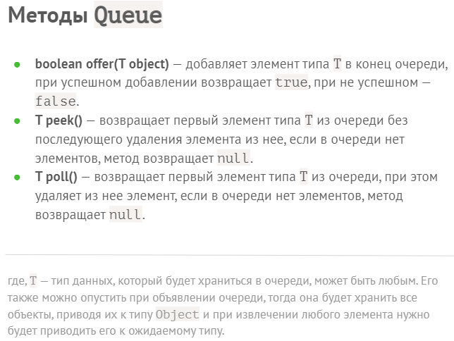
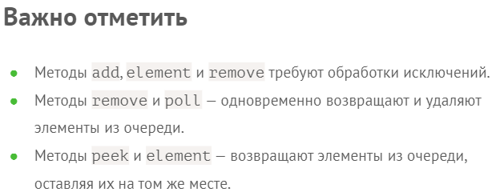
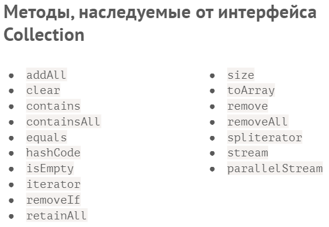
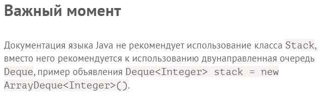
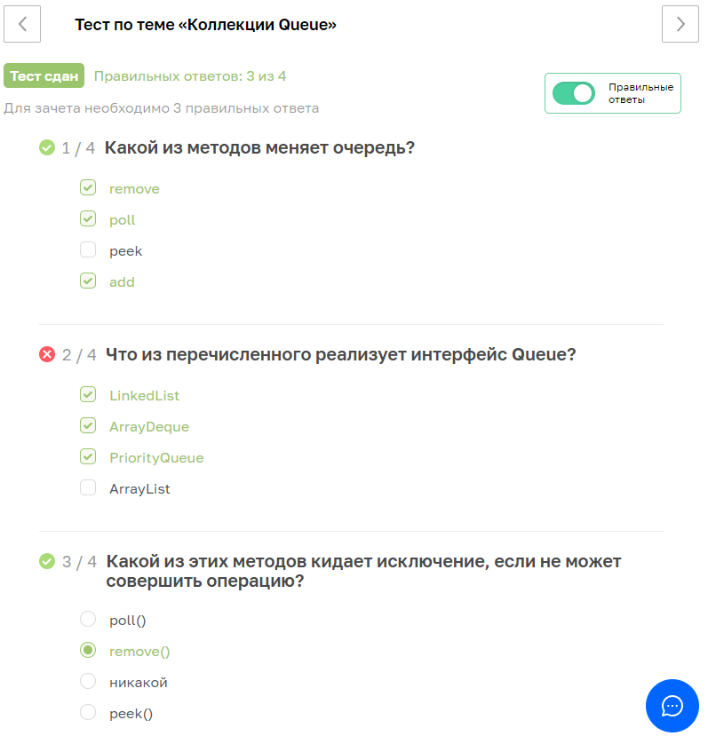
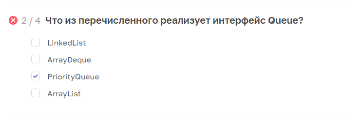

27.02.2023
---
# lesson18

## Коллекции Queue

	18.1		Очереди и PriorityQueue

### Queue
+ `Queue` — это интерфейс, описывающий контракт однонаправленной очереди без какой-либо реализации.
> Очереди не могут хранить значения `null`.
1. `offer` не кидает исключения, а дает ответ да или нет при добавлении
2. `pool` Извлекает элемент или `null`
3. `queue.peek()` только Показывает элемент в очереди не Извлекая в отличие от `pool`
4. `queue.isEmpty()` проверка пустоты Только через isEmpty
+ + класс Main
```java
import java.util.LinkedList;
import java.util.Queue;

public class MainBak1 {
    public static void main(String[] args) {
        Queue<String> queue = new LinkedList<>();
        queue.offer("Petya");// offer не кидает исключения, а дает ответ да или нет при добавлении
        queue.offer("Olya");
        queue.offer("Tanya");

        System.out.println(queue.peek());// peek только Показывает элемент в очереди не Извлекая
        System.out.println(queue.poll());// pool Извлекает эелемент или null
        System.out.println(queue.poll());
        System.out.println(queue.poll());
        System.out.println(queue.poll());
        System.out.println(queue.isEmpty());// проверка пустоты Только через isEmpty
    }
}
```

#
+ + класс Main
```java
import java.util.LinkedList;
import java.util.Queue;

public class Main {
    public static void main(String[] args) {
        Queue<String> queue = new LinkedList<>();
        queue.offer("Petya");// offer не кидает исключения, а дает ответ да или нет при добавлении
        queue.offer("Olya");
        queue.offer("Tanya");

        while (!queue.isEmpty()) {
            String s = queue.poll();
            System.out.println(s);
        }
    }
}
```

+ 
### Класс `AbstractQueue`
+ Примеры реализации AbstractQueue в JDK
+ На основе класса AbstractQueue в стандартной библиотеке Java реализованы следующие типы очередей:
1. ArrayBlockingQueue
2. ConcurrentLinkedQueue
3. DelayQueue
4. LinkedBlockingDeque
5. LinkedBlockingQueue
6. LinkedTransferQueue
7. PriorityBlockingQueue
8. PriorityQueue
9. SynchronousQueue

#### Класс PriorityQueue
+ Класс `PriorityQueue` — единственный класс, наследуемый только от интерфейса Queue и реализующей его.
> Данная коллекция так же не поддерживает хранение `null` в качестве элемента.
+ Можно поменять реализацию (не `LinkedList`) очереди и поменяется логика
+ `new PriorityQueue<>()` будет выдавать сравнивая, а не в порядке добавления
+ + класс Main
```java
import java.util.PriorityQueue;
import java.util.Queue;

public class Main {
    public static void main(String[] args) {
        Queue<String> queue = new PriorityQueue<>();// будет выдавать сравнивая, а не в порядке добавления
        queue.offer("Petya");// offer не кидает исключения, а дает ответ да или нет при добавлении
        queue.offer("Olya");
        queue.offer("Tanya");

        while (!queue.isEmpty()) {
            String s = queue.poll();
            System.out.println(s);
        }
    }
}
```
+ + можно указать компаратор - как?
+ Очереди используются там, где в реальной жизни нам нужны. Мы сами выбираем ту логику сравнения, которую хотим использовать внутри очереди.
#
	18.2		Деки и стэки

### Интерфейс Deque
+ Еще один важный интерфейс, наследуемый от интерфейса Queue - интерфейс Deque. Этот тип расширяет однонаправленную очередь до двунаправленной и позволяет работать в режиме не только First In, First Out, но и в Last In, First Out (последний вошел, первый вышел).
+ `Deque<String> deque = new LinkedList<>();` Двусторонняя очередь
+ + класс Main
```java
import java.util.Deque;
import java.util.LinkedList;

public class Main {
    public static void main(String[] args) {
        Deque<String> deque = new LinkedList<>();// Двусторонняя очередь
        deque.offerFirst("Petya");// работаем с первым концом
        System.out.println(deque.pollFirst());

        System.out.println(deque.poll());
    }
}
```
#
+ добавим на один конец, а снимем со второго:
+ + класс Main
```java
import java.util.Deque;
import java.util.LinkedList;

public class Main {
    public static void main(String[] args) {
        Deque<String> deque = new LinkedList<>();// Двусторонняя очередь
        deque.offerFirst("Petya");// работаем с первым концом
        System.out.println(deque.pollLast());// всё равно Petya, так как добавили Только с одного конца

        System.out.println(deque.poll());
    }
}
```
#### Примеры реализации Deque в JDK
+ На основе интерфейса Deque в стандартной библиотеке Java есть следующие коллекции:
1. ArrayDeque
2. ConcurrentLinkedDeque
3. LinkedBlockingDeque
4. LinkedList
> Наиболее часто используемые коллекции из этого списка: `ArrayDeque`, `LinkedList`
+ `Deque<String> deque = new ArrayDeque<>();` использует идею циклического массива
+ `ArrayDeque` работает быстрее `LinkedList`
+ + класс Main
```java
import java.util.ArrayDeque;
import java.util.Deque;

public class Main {
    public static void main(String[] args) {
        //  789___123456

        Deque<String> deque = new ArrayDeque<>();// массив
        deque.offerFirst("Petya");// работаем с первым концом
        System.out.println(deque.pollLast());// всё равно Petya, так как добавили Только с одного конца

        System.out.println(deque.poll());
    }
}
```
#### LinkedList vs ArrayDeque
+ Следующие отличия между классами LinkedList (сделан на основе списка) и ArrayDeque (сделан на основе массива):
   + Производительность вставки и удаления элементов с любого конца у ArrayDeque амортизировано (на большом количестве рассматриваемых случаев) выше, чем у LinkedList.
   + Для каждого элемента LinkedList выделяется больше памяти (следовательно, вся коллекция занимает больше памяти).
   + https://docs.oracle.com/javase/tutorial/collections/implementations/deque.html
### Класс Stack
> Класс Stack — реализован на основе класса Vector, в этом его недостаток, так как все операции в классе Vector синхронизированные, а значит медленные.
+ `Stack<String> stack = new Stack<>();` стопка: первым вошёл - последним вышел
+ `stack.push("Petya");` не общий для всех add, а свой метод push - положить на стопку
+ `stack.pop();`// без параметров - он просто снимает элемент на стопке
+ + класс Main
```java
import java.util.Stack;

public class Main {
    public static void main(String[] args) {
        Stack<String> stack = new Stack<>();// стопка: первым вошёл - последним вышел
        stack.push("Petya");// не общий для всех add, а свой метод push - положить на стопку
        stack.push("Olya");
        stack.push("Tanya");

        System.out.println(stack.pop());// без параметров - он просто снимает элемент на стопке
        System.out.println(stack.pop());
        System.out.println(stack.pop());
    }
}
```
#
> Но java не рекомендует напрямую использовать Stack! 
+ `Deque<String> s = new ArrayDeque<>();`// работаем со стопкой здесь, а не Stack
+ + класс Main
+ + обрати внимание на `import`
```java
import java.util.ArrayDeque;
import java.util.Deque;

public class Main {
    public static void main(String[] args) {
        Deque<String> s = new ArrayDeque<>();// работаем со стопкой здесь, а не Stack
        s.push("Petya");// не общий для всех add, а свой метод push - положить на стопку
        s.push("Olya");
        s.push("Tanya");

        while (!s.isEmpty()){
            System.out.println(s.pop());
        }
    }
}
```
#### Класс Stack реализует следующие методы
+ boolean empty() — возвращает true или false, проверяя, есть ли элементы в коллекции.
+ T peek() — возвращает последний элемент типа T из стека без последующего удаления элемента из него, если в стеке нет элементов, метод возвращает null.
+ T pop() — возвращает последний элемент типа T из стека при этом удаляет из него элемент, если в стеке нет элементов, метод возвращает null.
+ boolean push(T object) — добавляет элемент типа Т в конец стека, при успешном добавлении возвращает true, при не успешном добавлении false.
+ int search(Object o) — возвращает позицию элемента в стеке, если элемента нет метод возвращает -1.
+ https://docs.oracle.com/javase/8/docs/api/java/util/Stack.html
#
где, T — тип данных, который будет храниться в очереди, может быть любым. Его также можно опустить при объявлении очереди, тогда она будет хранить все объекты с приводя их к типу Object и при извлечении любого элемента нужно будет приводить его к ожидаемому типу.
#

***
### Тест

+ Queue<String> queue = new LinkedList<>();
+ Deque<String> deque = new ArrayDeque<>();
+ Queue<String> queue = new PriorityQueue<>();
+ так что ли? где я это должен был увидеть?

---
[*мои конспекты*](./README.md)
