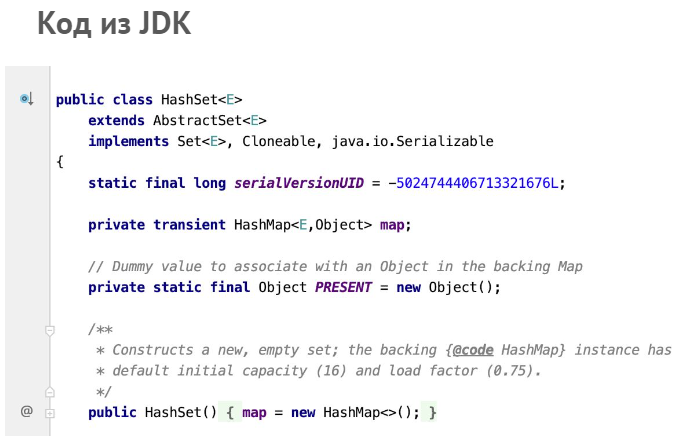
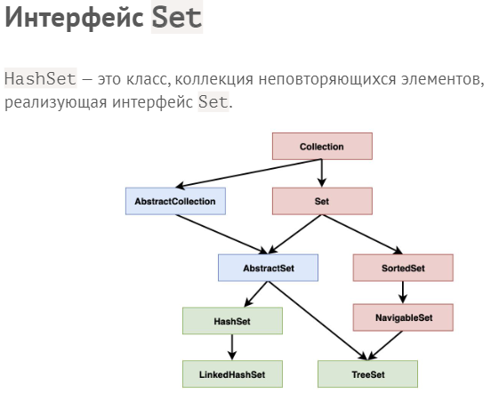

28.02.2023
---
# lesson19

## Коллекции HashSet и HashMap

	19.1		Нативная реализация ассоциативного массива

+ Удобство списков: у каждой ячейки есть собственный номер
   + класс `Main`
```java
import java.util.ArrayList;
import java.util.List;

public class Main {
    public static void main(String[] args) {
        List<String> list = new ArrayList<>();
        list.add("Petya");
        list.add("Olya");
        list.add("Tanya");

        String name = list.get(1);
        list.set(1, "Kolya");
        System.out.println(name+" "+list.get(1));
    }
}
```
+ Хотим работать с метками ячеек - есть такой метод, только не `set`, а `put`
+ Пробуем сами создать `MyMap`
+ Один большой список, где объект хранит пару ключ-значение - создаем специальный класс `MyMapPair`
+ теперь можем создать в `MyMap` поле, в котором будет храниться список всех пар ключ-значение:
```java
protected List<MyMapPair<K, V>> pairs = new ArrayList<>();
```
+ дальше `put` - пройти по списку и либо изменить, либо добавить значение по ключу:
```java
public void put(K key, V value) {
        for (MyMapPair<K, V> kv : pairs) {
            if (kv.getKey().equals(key)) {
                kv.setValue(value);
                return;
            }
        }
        MyMapPair<K, V> newKv = new MyMapPair<>(key, value);
        pairs.add(newKv);
    }
```
> объект `MyMap` хранит информацию о добавленных ключах у себя в списке
+ дальше get аналогично по списку:
```java
public V get(K key) {
        for (MyMapPair<K, V> kv : pairs) {
            if (kv.getKey().equals(key)) return kv.getValue();
        }
        return null;
    }
```
+ в `UserInfo`, к примеру, будем хранить и возвращать просто возраст
#### UserInfo
```java
public class UserInfo {
    protected int age;

    public UserInfo(int age) {
        this.age = age;
    }

    @Override
    public String toString() {
        return " " + age;
    }
}
```
#### MyMapPair
```java
public class MyMapPair<K, V> {// объект хранит пару ключ-значение
    protected K key;
    protected V value;

    public MyMapPair(K key, V value) {
        this.key = key;
        this.value = value;
    }

    public K getKey() {
        return key;
    }

    public V getValue() {
        return value;
    }

    public void setValue(V value) {
        this.value = value;
    }
}
```
#### MyMap
```java
import java.util.ArrayList;
import java.util.List;

public class MyMap<K, V> {
    protected List<MyMapPair<K, V>> pairs = new ArrayList<>();// будет храниться список всех пар ключ-значение

    public void put(K key, V value) {// пройти по списку и либо изменить, либо добавить значение по ключу
        for (MyMapPair<K, V> kv : pairs) {
            if (kv.getKey().equals(key)) {// если находим совпадение ключа
                kv.setValue(value);// меняем значение по этому ключу
                return;
            }
        }// или
        MyMapPair<K, V> newKv = new MyMapPair<>(key, value);// создаем новую пару для этого ключа
        pairs.add(newKv);
    }

    public V get(K key) {
        for (MyMapPair<K, V> kv : pairs) {
            if (kv.getKey().equals(key)) return kv.getValue();
        }
        return null;
    }
}
```
#### Main
```java
import java.util.ArrayList;
import java.util.List;

public class Main {
    public static void main(String[] args) {
        List<String> list = new ArrayList<>();
        list.add("Petya");
        list.add("Olya");
        list.add("Tanya");

        String name = list.get(1);// Удобство списков: у каждой ячейки есть собственный номер
        list.set(1, "Kolya");
        System.out.println(name + " " + list.get(1));

        MyMap<String, UserInfo> map = new MyMap<>();
        map.put("Petya", new UserInfo(8));// ассоциативный массив: ячейки маркированы другими объектами
        map.put("Olya", new UserInfo(15));// здесь Ключ и Значение

        UserInfo info = map.get("Olya");
        System.out.println(info);
    }
}
```
> производительность такой структуры данных объяснять не надо: бегает по спискам в циклах. в случае с ассоциативным массивом скорость зависит от размера.
#
	19.2		Хэширование и HashMap

+ `Map` - интерфейс и надо выбрать Класс для его реализации. Например, **класс `HashMap`**
   + `Main`
```java
import java.util.HashMap;
import java.util.Map;

public class Main {
    public static void main(String[] args) {
        Map<String, Integer> map = new HashMap<>();
        map.put("Petya", 8);
        map.put("Olya", 15);
        int age = map.get("Olya");// java позволяет конвертировать из одной пары типов
        System.out.println(age);
    }
}
```
### Хэширование
+ хэш-код должен возвращать одно и тоже число для одинаковых объектов
```java
System.out.println("Hello".hashCode());
```
+ если использовать свой тип, то надо переопределить хэш-код
   + `UserInfo`
```java
public class UserInfo {
    protected String name;
    protected int age;

    public UserInfo(String name, int age) {
        this.name = name;
        this.age = age;
    }

    @Override
    public int hashCode() {
        return name.hashCode();
    }

    @Override
    public boolean equals(Object obj) {
        UserInfo o = (UserInfo) obj;
        return name.equals(o.name);// наше имя совпадает с именем переданного объекта
    }
}
```
> **Вопрос **
   > Может ли для разных строк или любых других объектов вычисляться один и тот же хеш-код? 
> **Ответ**
   > Да, такое явление называется коллизией. Для разрешения коллизий используются разные методы. В `Java`, если по одному индексу, определенному по хешкоду, находятся несколько элементов, то нужный находится с помощью вызовов `equals` на каждом из элементов, находящихся в этой ячейке массива.
### А если name и surname?
```java
@Override
    public int hashCode() {
        return name.hashCode() + surname.hashCode();// очень плохой вариант
    }

@Override
    public boolean equals(Object obj) {
        UserInfo o = (UserInfo) obj;
        return name.equals(o.name) && surname.equals(o.surname);
    }
```
+ есть специальный Метод
```java
@Override
    public int hashCode() {
        return Objects.hash(name, surname);
    }
```
#### UserInfo
+ теперь можем использовать тип `UserInfo`, например в `Map<UserInfo, Integer> map = new HashMap<>();`
```java
import java.util.Objects;

public class UserInfo {
    protected String name;
    protected String surname;
    protected int age;

    public UserInfo(String name, int age) {
        this.name = name;
        this.age = age;
    }

    @Override
    public int hashCode() {
        return Objects.hash(name, surname);// есть специальный метод
    }

    @Override
    public boolean equals(Object obj) {
        UserInfo o = (UserInfo) obj;
        return name.equals(o.name) && surname.equals(o.surname);
    }
}
``` 
### В `Map` много всяких методов
+ выведем на экран все пары ключ-значение в `Map`е 
#### `Main` простым перебором
```java
import java.util.HashMap;
import java.util.Map;

public class Main {
    public static void main(String[] args) {
        Map<String, Integer> map = new HashMap<>();
        map.put("Petya", 8);
        map.put("Olya", 15);

        for (String key : map.keySet()) {// перебираем все ключи
            int value = map.get(key);
            System.out.println(key + " - " + value);
        }
    }
}
```
+ другим же способом сразу выведем всю коллекцию из пар ключ-значение
#### `Main` через коллекцию пар ключ-значение
```java
import java.util.HashMap;
import java.util.Map;

public class Main {
    public static void main(String[] args) {
        Map<String, Integer> map = new HashMap<>();
        map.put("Petya", 8);
        map.put("Olya", 15);

        for (String key : map.keySet()) {// перебираем все ключи
            int value = map.get(key);
            System.out.println(key + " - " + value);
        }
        for (Map.Entry<String, Integer> kv : map.entrySet()) {// специальный метод
            System.out.println(kv.getKey() + " * " + kv.getValue());
        }
    }
}
```
> что-то сложно как-то
+ такой вот **класс `HashMap`**
#### Отличие HashMap и Hashtable
   > Как и в случае с коллекциями `Stack` и `Vector`, `Hashtable` считается устаревшей и менее производительной, чем `HashMap`.

#
	19.3		Множества и HashSet

### Set
   > - это множество (так же называют «набором»). Set не допускает хранение двух одинаковых элементов. Формально говоря, термин «множество» и так обозначает совокупность различных элементов, очень важно, что именно различных элементов, так как это главное свойство Set. 
+ Все множества в `java` объединяет интерфейс `Set`
+ множества не допускают дубликаты
+ `HashSet` - скорость, в отличие от пронумерованных списков `List<String> list = new ArrayList<>();`, не зависит от размера
+ у множества можно использовать только те типы <>, у которых корректно реализован хэш-код
#### `Main`
```java
import java.util.HashSet;
import java.util.Set;

public class Main {
    public static void main(String[] args) {
        Set<String> set =new HashSet<>();// Все множества в `java` объединяет интерфейс `Set`
        set.add("Petya");
        set.add("Olya");
        set.add("Petya");// множества не допускают дубликаты
        System.out.println(set);// само множество не гарантирует никакого порядка при добавлении элемента
        System.out.println(set.contains("Olya"));// множество заточено под использование contains
    }
}
```
#

#

#
[Дополнительно: "Java собеседование. Коллекции"](https://habr.com/ru/post/162017/)

---
[*мои конспекты*](./README.md)
