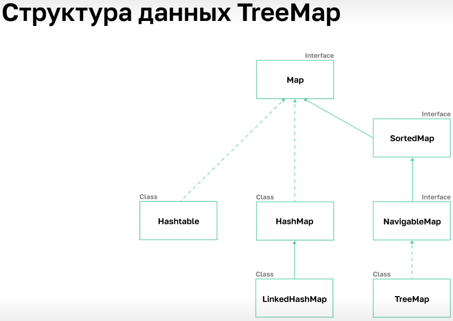
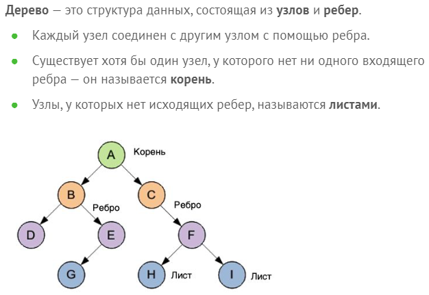
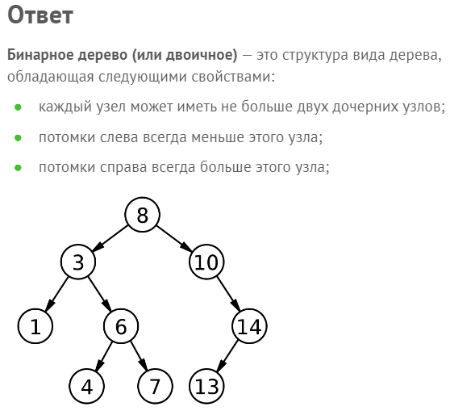
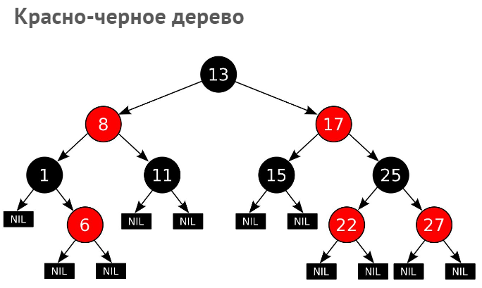
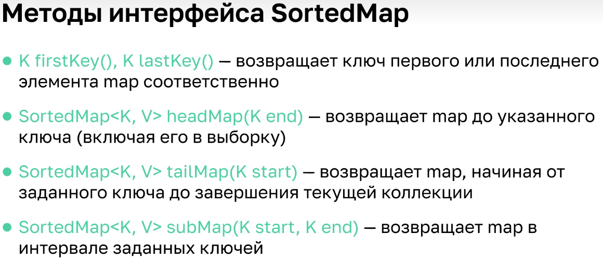
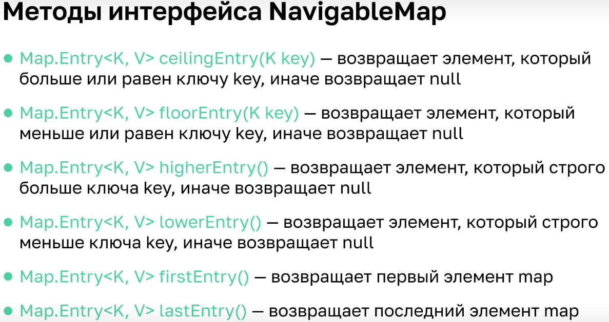
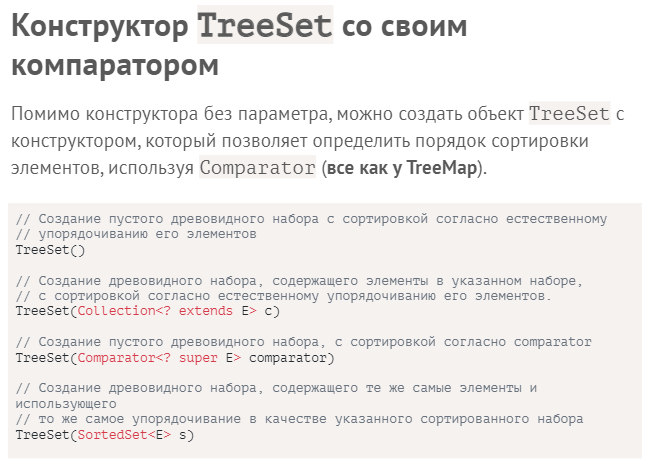

05.03.2023
---
# lesson20

## Коллекции TreeMap и TreeSet

	20.1		Comparable и компараторы

### Интерфейс `Comparable` - Сопоставимые
> его объекты могут сравниваться между собой
```java
public class Person {// как java научить сравнивать объекты этого класса?
    protected String name;
//    protected int age;
}
```
### сравнение по `name`
   + `Person`
```java
public class Person implements Comparable<Person> {// как java научить сравнивать объекты этого класса?
    protected String name;
//    protected int age;

    public PersonBak1(String name) {
        this.name = name;
    }

    @Override
    public int compareTo(PersonBak1 o) {// три варианта значения: -1, 0, 1
        return name.compareTo(o.name);// String уже умеет хорошо сравнивать
    }
}
```
   + `Main`
```java
public class Main {
    public static void main(String[] args) {
        Person p1 = new Person("Petya");
        Person p2 = new Person("Olya");
        // хотим сравнить эти два объекта
        System.out.println(p1.compareTo(p2));
    }
}
```
### сравнение по `age`
   + `Person`
```java
public class Person implements Comparable<Person> {// как java научить сравнивать объекты этого класса?
    //    protected String name;
    protected int age;

    public Person(int age) {
        this.age = age;
    }

    @Override
    public int compareTo(Person o) {
//        return age - o.age;// как раз удовлетворим принципам метода
        return Integer.compare(age, o.age);// уже есть специальный метод
    }
}
```
   + `Main`
```java
public class Main {
    public static void main(String[] args) {
        Person p1 = new Person(40);
        Person p2 = new Person(45);
        // хотим сравнить эти два объекта
        System.out.println(p1.compareTo(p2));
    }
}
```
### Соблюдение контракта между `compareTo` и `equals`
> если хотим сравнить объекты только по одному полю, то в compareTo использовать только эти поля по аналогии с хэшкодом
+ Сравнение должно работать симметрично: если при сравнении один объект > второго, то в обратном сравнении второй < первого!
   + `Main`
```java
public class Main {
    public static void main(String[] args) {
        Person p1 = new Person(40);
        Person p2 = new Person(45);
        // хотим сравнить эти два объекта
        System.out.println(p1.compareTo(p2));
        System.out.println(p1.equals(p2));// соблюдение контракта между compareTo и equals

        // Сравнение должно работать симметрично:
        // если при сравнении один объект > второго,
        // то в обратном сравнении второй < первого!
    }
}
```
### Сравнение по двум полям
   + `Person`
```java
public class Person implements Comparable<Person> {
    protected String name;
    protected int age;

    public Person(String name, int age) {
        this.name = name;
        this.age = age;
    }

    @Override
    public int compareTo(Person o) {
        if (age < o.age) return -1;// сначала сравниваем по первому "главному" параметру
        else if (age > o.age) return 1;
        else return name.compareTo(o.name);// по второму при равенстве первого
    }

    @Override
    public String toString() {
        return name + " " + age;
    }
}
```
#### создаем список
   + `Main`
```java
import java.util.ArrayList;
import java.util.Collections;
import java.util.List;

public class Main {
    public static void main(String[] args) {
        List<Person> people = new ArrayList<>();
        people.add(new Person("Petya", 8));
        people.add(new Person("Tanya", 15));
        people.add(new Person("Olya", 8));
        people.add(new Person("Anya", 8));
        System.out.println(people);

        Collections.sort(people);
        // у Java не будет проблем с сортировкой,
        // потому что её уже научили
        // объекты Person сравнивать между собой
        System.out.println(people);
    }
}
```
+ `Collections.` содержит множество вспомогательных методов для работы с коллекциями
#
+ Если надо сравнивать по другому принципу?
### Специальный интерфейс компаратор - `Comparator`
> Comparator - отдельный класс, чтобы сравнивать объекты какого-то другого класса
   + `PersonsNameLengthComparator`
```java
import java.util.Comparator;

public class PersonsNameLengthComparator implements Comparator<Person> {
    @Override
    public int compare(Person o1, Person o2) {
        return Integer.compare(o1.name.length(), o2.name.length());// хотим сравнить по длине имени
    }
}
```
> `.sort` - может принимать вторым параметром принцип сортировки
   + `Main`
```java
import java.util.ArrayList;
import java.util.Collections;
import java.util.List;

public class Main {
    public static void main(String[] args) {
        List<Person> people = new ArrayList<>();
        people.add(new Person("Petya", 8));
        people.add(new Person("Tanya", 15));
        people.add(new Person("Olya", 8));
        people.add(new Person("Anya", 8));
        System.out.println(people);

        Collections.sort(people, new PersonsNameLengthComparator());
        // для сравнения будет использовать объект компаратора

        System.out.println(people);
    }
}
```

#
	20.2		TreeSet и TreeMap

+ учимся реализовывать ассоциативный массив и множество используя сравнения объектов между собой
### Идея красно-чёрных деревьев `TreeMap`

   > `Class` - это реализация `Interface`
> `TreeMap` — структура данных, которая хранит элементы в отсортированном по ключам виде.
+ Это значит, что коллекция хранит пары элементов ключ-значение. Добавлять / удалять / искать / изменять элементы можно только с использованием их ключа, по которому и происходит сортировка элементов внутри коллекции.
+ `TreeMap` требует корректную реализацию `.compareTo` классом ключей (либо указать компаратор!), как `HashMap` требовал `.hashCode`

+ `TreeMap` основан на красно-черном дереве, вследствие чего `TreeMap` сортирует элементы по ключу в естественном порядке или на основе заданного при создании коллекции компаратора.
> Красно-черное дерево является бинарным деревом.


+ Класс `TreeMap` реализует интерфейс `NavigableMap`, который наследует методы интерфейса `SortedMap`.


   + `Main`
```java
import java.util.Map;
import java.util.TreeMap;

public class Main {
    public static void main(String[] args) {
        Map<String, Integer> map = new TreeMap<>();
        // используем реализацию ассоциативного массива на деревьях

        map.put("Petya",8);
        map.put("Olya",15);
        int age= map.get("Petya");
        System.out.println(age);
    }
}
```
+ `TreeMap` гарантирует скорость доступа `log(n)` для операций `containsKey`, `get`, `put` и `remove`.

### Специальный класс `TreeSet`, который реализует интерфейс множества
   + `Main`
```java
import java.util.Set;
import java.util.TreeSet;

public class Main {
    public static void main(String[] args) {
        Set<String> set = new TreeSet<>();
        // реализация множества основанная на деревьях
        set.add("Petya");
        set.add("Olya");
        set.add("Petya");
        System.out.println(set);
    }
}
```
> ключ как и в `TreeMap` должен быть сравниваемым!
   > если будем использовать на каком-то своём классе не передав компаратор, то это приведёт к ошибке

+ каша про `Comparator` в `TreeSet`, которую надо изучать отдельно. обязательно использование машины времени, чтобы после длительного изучения вернуться в эту дату.

##### Program
```java
import java.util.NavigableSet;
import java.util.SortedSet;
import java.util.TreeSet;

public class Program {
    public static void main(String[] args) {
        // каталог книг в онлайн-магазине
        TreeSet<String> catalog = new TreeSet<String>();
        // добавим в список ряд элементов
        catalog.add("1984");
        catalog.add("Шантарам");
        catalog.add("Властелин Колец");
        catalog.add("Гарри Поттер");
        catalog.add("Три товарища");
        System.out.println(catalog.first());
        // получим первый — самый меньший элемент — 1984
        System.out.println(catalog.last());
        // получим последний — самый больший элемент — Шантарам

        // получим поднабор от одного элемента до другого
        SortedSet<String> set = catalog.subSet("Властелин Колец", "Шантарам");
        System.out.println(set);
        // [Властелин Колец, Гарри Поттер, Три товарища]

        // элемент из набора, который больше текущего
        String greater = catalog.higher("1984");
        System.out.println(greater);
        // [Властелин Колец]

        // элемент из набора, который меньше текущего
        String lower = catalog.lower("Три товарища");
        System.out.println(lower);
        // [Гарри Поттер]

        // возвращаем набор в обратном порядке
        NavigableSet<String> navSet = catalog.descendingSet();
        System.out.println(navSet);
        // [Шантарам, Три товарища, Гарри Поттер, Властелин Колец, 1984]

        // возвращаем набор, в котором все элементы меньше текущего
        SortedSet<String> setLower = catalog.headSet("Три товарища");
        System.out.println(setLower);
        // [1984, Властелин Колец, Гарри Поттер]

        // возвращаем набор, в котором все элементы больше текущего
        SortedSet<String> setGreater = catalog.tailSet("Властелин Колец");
        System.out.println(setGreater);
        // [Властелин Колец, Гарри Поттер, Три товарища, Шантарам]
    }
}
```

#### Отличия между TreeSet и HashSet
+ **HashSet** не поддерживает никакого порядка хранения элементов, **TreeSet** применяет натуральную сортировку к элементам.
+ **HashSet** может хранить `null` объекты, **TreeSet** не может.
+ **HashSet** для сравнивания элементов использует `equals()` и `hashCode()`, **TreeSet** использует `compare()` или `compareTo()`.
+ **HashSet** обеспечивает лучшую производительность — константную временную производительность для большинства операций `add()`, `remove()` и `contains()`, **TreeSet** обеспечивает `log(n)`.
+ **TreeSet** благодаря методам `pollFirst()`, `pollLast()`, `first()`, `last()`, `ceiling()`, `lower()` можно использовать более гибко.
#### Применение TreeSet
**TreeSet** необходимо использовать:
+ когда требуется эффективный способ сортировать по какому-то признаку или нескольким признакам большое количество уникальных элементов, но следует держать в уме, что **TreeSet** немного медленнее **HashMap**;
+ если нет возможности задать «хорошую» хэш-функцию распределения объектов, то **TreeSet** может оказаться даже эффективнее;
+ также полезно использовать методы **TreeSet**: `headSet`, `tailSet`, `subSet` при операциях поиска или выделения подмножества над сортированным множеством.

---
[*мои конспекты*](./README.md)
